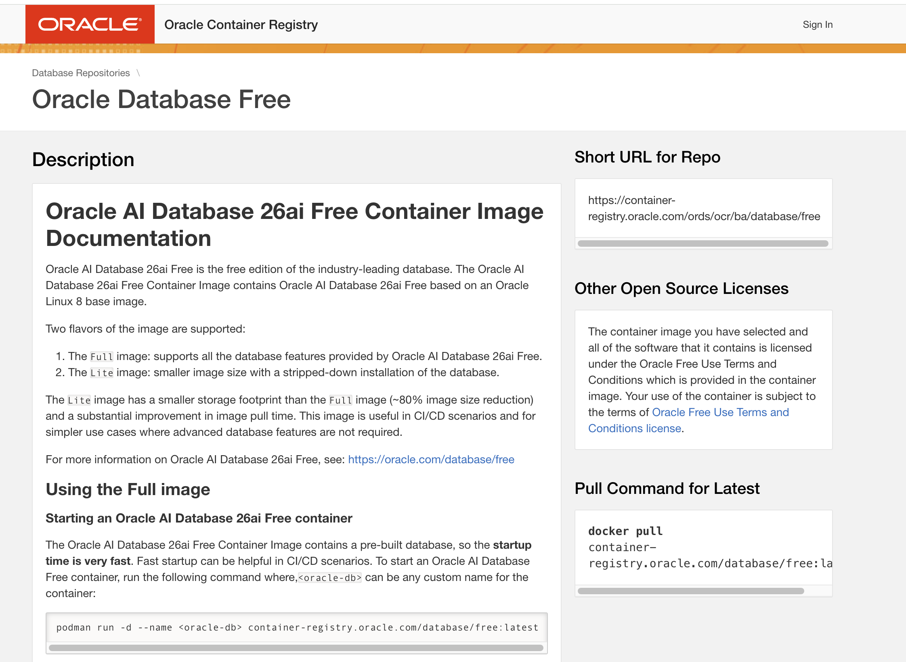
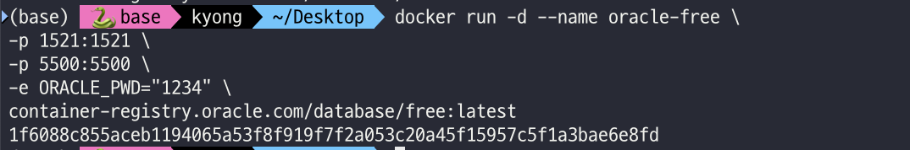
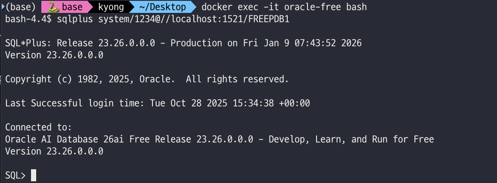

# Oracle Database 설치 가이드


## 설치 과정

### 1. Oracle Container Registry에서 이미지 정보 확인

1. [https://container-registry.oracle.com](https://container-registry.oracle.com)에 접속합니다.
2. **Database** → **free** → **Oracle AI Database 26ai Free Container Image Documentation**로 이동합니다.
3. 우측의 **'Pull Command for Latest'**를 확인합니다.



---

### 2. Docker 이미지 다운로드

다음 명령어로 Oracle Database Free 이미지를 다운로드합니다.

```bash
docker pull container-registry.oracle.com/database/free:latest
```


> 이미지 크기가 크므로 다운로드에 시간이 걸릴 수 있습니다.

---

### 3. Oracle 컨테이너 실행

다음 명령어로 Oracle Database 컨테이너를 실행합니다.

```bash
docker run -d --name oracle-free \
-p 1521:1521 \
-p 5500:5500 \
-e ORACLE_PWD="1234" \
container-registry.oracle.com/database/free:latest
```



**옵션 설명:**
- `-d`: 백그라운드 실행
- `--name oracle-free`: 컨테이너 이름 지정
- `-p 1521:1521`: Oracle 데이터베이스 포트 매핑
- `-p 5500:5500`: Oracle Enterprise Manager 포트 매핑
- `-e ORACLE_PWD="1234"`: SYS, SYSTEM 사용자의 비밀번호 설정

> 첫 실행 시 데이터베이스 초기화에 시간이 걸릴 수 있습니다. `docker logs -f oracle-free` 명령어로 진행 상황을 확인할 수 있습니다.

---

### 4. 컨테이너 접속

실행 중인 Oracle 컨테이너에 접속합니다.

```bash
docker exec -it oracle-free bash
```


---

### 5. SQL*Plus로 데이터베이스 접속

컨테이너 내부에서 SQL*Plus를 실행하여 데이터베이스에 접속합니다.

```bash
sqlplus system/1234@//localhost:1521/FREEPDB1
```



**접속 정보:**
- 사용자명: `system`
- 비밀번호: `1234` (위에서 설정한 ORACLE_PWD)
- 서비스명: `FREEPDB1`

---

## 실습 준비

이제 [SCOTT 스키마](./scott.md)를 생성하고 교수님 교안의 쿼리를 실행할 수 있습니다.

제공된 `.sql` 파일을 사용하여 실습을 진행하세요.

---

## 자주 사용하는 명령어

### 컨테이너 상태 확인
```bash
docker ps
```

### 컨테이너 중지
```bash
docker stop oracle-free
```

### 컨테이너 시작
```bash
docker start oracle-free
```

### 컨테이너 로그 확인
```bash
docker logs -f oracle-free
```

### 컨테이너 삭제
```bash
docker stop oracle-free
docker rm oracle-free
```

---

## 문제 해결

### 컨테이너가 시작되지 않는 경우
- 포트 1521, 5500이 이미 사용 중인지 확인하세요.
- `docker logs oracle-free`로 에러 메시지를 확인하세요.

### SQL*Plus 접속이 안 되는 경우
- 데이터베이스 초기화가 완료될 때까지 기다려주세요 (최대 5-10분 소요).
- `docker logs -f oracle-free`로 "DATABASE IS READY TO USE!" 메시지를 확인하세요.
